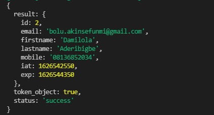

# decipher-jwt
    A simple node package that deciphers jwt token into json object

## Installation
With NPM: <br>
     $ npm install decipher-jwt
With YARN: <br>
     $ yarn add decipher-jwt

## Author
    Boluwaji Akinsefunmi
Published by [MasterCraft](https://github.com/IAmMasterCraft/)
    Inspired by 
[Isaac Kelvin OziKelvin](https://github.com/ozikelvin)

## Usage
```javascript
    const { decipherJwt } = require("decipher-jwt");
    const jwtToken = "Bearer xxxxxxxxxxx.xxxxxxxxx.xxxxxxx";
    console.log(decipherJwt(jwtToken));
```

## Outcome
### Success
 <br>
### Failure


## Contributions
    Pull requests are welcome. For major changes, please open an issue first 
    to discuss what you would like to change.

## License
[MIT License](./LICENSE)